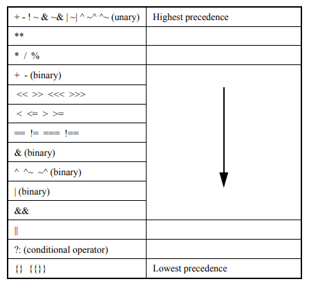

# Operators

The symbols for the Verilog HDL operators are similar to those in the C programming language

- `{}`,`{{}}`  Concatination, Replication
- `+`,`-`,`*`,`/`,`**` Arithematic Operations ⁜
- `%` Modulus Operation
- `>`,`<`,`>=`,`<=` Relational Operations ⁜
- `!` Logical Negation ⁜
- `&&` Logical AND ⁜
- `||` Logical OR ⁜
- `==` Logical Equality ⁜
- `!=` Logical Inequality ⁜
- `===` Case Equality
- `!==` Case Inequality
- `~` Bitwise Negation
- `&` BItwise AND
- `|` Bitwise OR
- `^` Bitwise Xor
- `&` Reduction AND
- `|` Reduction OR
- `<<` Logical Left Shift
- `>>` Lofgical Right Shift
- `<<<` Arithmatic Left Shift
- `>>>` Arithmatic Rigth Shift
- `?:` Conditional ⁜

⁜ -> Legal operators for use in real expressions, Other operation are illegal for real expressions.

###  Operator precedence

```
A + B / C
```
```
(A + B) / C
```

As you know, the above two expressions are not the same. Each operator have different precedence as shown in the below table.


### Equality and Relaton Operation

| Operation | Result |
| --- | --- |
| a>b | a greater than b |
| a<b | a less than b |
| a>=b | a greater than or equal to b |
| a<=b |  a less than or equal to b |
| a==b | a equal to b, result can be unknown |
| a!=b | a not equal to b, result can be unknown |
| a===b | a equal to b, including x and z |
| a!==b |  a not equal to b, including x and z |

### BItwise Opertions

| & | 0 | 1 | x | z |
| --- | --- | --- | --- | ---|
| 0 | 0 | 0 | 0 | 0 |
| 1 | 0 | 1 | x | x |
| x | 0 | x | x | x |
| z | 0 | x | x | x | 

Bitwise binary and operator

|  | 0 | 1 | x | z |
| --- | --- | --- | --- | ---|
| 0 | 0 | 1 | x | x |
| 1 | 1 | 1 | 1 | 1 |
| x | x | 1 | x | x |
| z | x | 1 | x | x | 

Bitwise binary and operator

| ^ | 0 | 1 | x | z |
| --- | --- | --- | --- | ---|
| 0 | 0 | 1 | x | x |
| 1 | 1 | 0 | x | x |
| x | x | x | x | x |
| z | x | x | x | x | 

Bitwise binary xor operator

| ~^ | 0 | 1 | x | z |
| --- | --- | --- | --- | ---|
| 0 | 1 | 0 | x | x |
| 1 | 0 | 1 | x | x |
| x | x | x | x | x |
| z | x | x | x | x | 

Bitwise binary xnor operator

| ~ | |
| --- | --- |
| 0 | 1 |
| 1 | 0 |
| x | x |
| x | x |

Bitwise unary negation operator

### Reduction Opertions

The unary reduction operators shall perform a bitwise operation on a single operand to produce a single-bit result. For reduction and, reduction or, and reduction xor operators, the first step of the operation shall apply the operator between the first bit of the operand and the second using the below logics.

| & | 0 | 1 | x | z |
| --- | --- | --- | --- | ---|
| 0 | 0 | 0 | 0 | 0 |
| 1 | 0 | 1 | x | x |
| x | 0 | x | x | x |
| z | 0 | x | x | x | 

Reduction binary and operator

|   | 0 | 1 | x | z |
| --- | --- | --- | --- | ---|
| 0 | 0 | 1 | x | x |
| 1 | 1 | 1 | 1 | 1 |
| x | x | 1 | x | x |
| z | x | 1 | x | x | 

Reduction binary or operator

| ^ | 0 | 1 | x | z |
| --- | --- | --- | --- | ---|
| 0 | 0 | 1 | x | x |
| 1 | 1 | 0 | x | x |
| x | x | x | x | x |
| z | x | x | x | x | 

Reduction binary and operator

Some Examples

| Operand | & | ~& | OR | NOR | ^ | ~^ | Comments
|---|---|---|---|---|---|---|---|
| 4b'0000 | 0 | 1 | 0 | 1 | 0 | 1 | No bits set |
| 4b'1111 | 1 | 0 | 1 | 0 | 0 | 1 | No bits set |
| 4b'0110 | 0 | 1 | 1 | 0 | 0 | 1 | No bits set |
| 4b'1000 | 0 | 1 | 1 | 0 | 1 | 0 | No bits set |

### Shift Operators

There are two types of shift operators: the logical shift operators, << and >>, and the arithmetic shift operators, <<< and >>>. The left shift operators, << and <<<, shall shift their left operand to the left by the number by the number of bit positions given by the right operand. In both cases, the vacated bit positions shall be filled with zeroes. The right shift operators, >> and >>>, shall shift their left operand to the right by the number of bit positions given by the right operand. The logical right shift shall fill the vacated bit positions with zeroes. The arithmetic right shift shall fill the vacated bit positions with zeroes if the result type is unsigned.

### Conditional Operator

The conditional operator, also known as ternary operator, shall be right associative and shall be constructed using three operands separated by two operators in the format is
```
expression1 ? { attribute_instance } expression2 : expression3
```

### Concatenations

A concatenation is the result of the joining together of bits resulting from one or more expressions. The concatenation shall be expressed using the brace characters { and }, with commas separating the expressions within.

```
{a, b[3:0], w, 3'b101}
```
It is equivalent to the following example:
-> {a, b[3], b[2], b[1], b[0], w, 1'b1, 1'b0, 1'b1}

### Replications
```
{4{w}} // This yields the same value as {w, w, w, w}
```
but

{1'bz{1'b0}} // illegal

{1'bx{1'b0}} // illegal