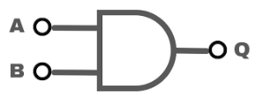

# AND Gate
### Brief Description

An AND gate is a fundamental digital logic gate that implements logical conjunction. It outputs true or high (1) only if all of its inputs are true or high. If any input is false or low (0), the output is false or low. In essence, the AND gate performs the multiplication operation in binary logic.

**Symbol:**

| A | B | Q|
| --- | --- | --- |
| 0 | 0 | 0|
| 0 | 1 | 0|
| 1 | 0 | 0|
| 1 | 1 | 1|

In Verilog, there are several ways to implement an AND gate. Here are a few methods:

### Implementation Methods
**1. Using assign Statement:**

This is the most straightforward way to implement an AND gate in Verilog using continuous assignment.

[and_gate](and_gate.v) is implemented using assign statement.

**2. Using always Block:**

The always block is used for procedural assignments. This is not typical for a simple AND gate but is useful for learning purposes and more complex logic.

[and_gate_always](and_gate_always.v) is implemented using always block.

**3. Using Behavioral Modeling:**

This method called behavioral modeling, which is more descriptive and often used in higher-level design.

[and_gate_behavioral](and_gate_behavioral.v) is implemented using Behavioral modeling.

**4. Using Gate-Level Modeling:**

Verilog provides built-in primitives for basic gates. Keyword like `and` can be use for gate implementation.

[and_gate_primitive](and_gate_primitive.v) is implemented using Gate-Level modeling.

**5. Using Generate Statements:**

Generate statements are useful for creating multiple instances of a gate, often used in more complex designs.

[and_gate_generate](and_gate_generate.v) is implemented using Generate.

> Each method has its use case depending on the complexity of the design and the designer’s preference. For simple gates, the `assign` statement is most commonly used due to its simplicity and clarity. For more complex designs, other methods like always blocks, behavioral modeling, or generate statements might be more appropriate.

### Testbench

A simple testbench is here [and_gate_tb.v](and_gate_tb.v) to simulate `and_gate` . By replacing the module name we can simulate other designes too.

## Properties of AND Gate

An AND gate is a fundamental digital logic gate that outputs true or high (1) only when all its inputs are true or high. Here are some key properties:

### Idempotent Law
- **Formula:** `A AND A = A`
- **Example:** If `A = 1`, then `1 AND 1 = 1`.

### Identity Law
- **Formula:** `A AND 1 = A`
- **Example:** If `A = 0`, then `0 AND 1 = 0`.

### Domination Law
- **Formula:** `A AND 0 = 0`
- **Example:** Regardless of `A`, the result is always 0.

### Commutative Law
- **Formula:** `A AND B = B AND A`
- **Example:** `0 AND 1 = 1 AND 0 = 0`.

### Associative Law
- **Formula:** `(A AND B) AND C = A AND (B AND C)`
- **Example:** `(1 AND 0) AND 1 = 1 AND (0 AND 1) = 0`.

### Distributive Law
- **Formula:** `A AND (B OR C) = (A AND B) OR (A AND C)`
- **Example:** `1 AND (0 OR 1) = (1 AND 0) OR (1 AND 1) = 0 OR 1 = 1`.

### Absorption Law
- **Formula:** `A AND (A OR B) = A`
- **Example:** `0 AND (0 OR 1) = 0`.

### Negation Law
- **Formula:** `A AND NOT(A) = 0`
- **Example:** If `A = 1`, then `1 AND NOT(1) = 1 AND 0 = 0`.

These properties are foundational in digital logic design and are used to simplify and analyze complex logic circuits.
