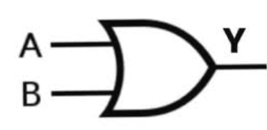

# OR Gate

#### Brief Description

An OR gate is another fundamental digital logic gate that implements logical disjunction. It outputs true or high (1) if at least one of its inputs is true or high. The output is false or low (0) only when all of its inputs are false or low. In essence, the OR gate performs the addition operation in binary logic, but without carrying over.

**Symbol:**
 
 

**Truth Table:**

| A | B | Y |
|---|---|---|
| 0 | 0 | 0 |
| 0 | 1 | 1 |
| 1 | 0 | 1 |
| 1 | 1 | 1 |

In Verilog, there are several ways to implement an OR gate. Here are a few methods:

#### Implementation Methods

1. **Using `assign` Statement:**
   
   This is the most straightforward way to implement an OR gate in Verilog using continuous assignment.

   > [or_gate.v](or_gate.v)

2. **Using `always` Block:**
   
   The `always` block is used for procedural assignments. This method is more illustrative for learning and complex logic, although not typical for simple gates.

   > [or_gate_always](or_gate_always.v)

3. **Using Behavioral Modeling:**
   This method leverages behavioral modeling, which is more descriptive and often used in higher-level design.

   > [or_gate_behavioral](or_gate_behavioral.v)

4. **Using Gate-Level Primitives:**
   Verilog provides built-in primitives for basic gates. Here’s how you can use the `or` primitive.

   > [or_gate_primitive](or_gate_primitive.v)

5. **Using Generate Statements:**
   Generate statements are useful for creating multiple instances of a gate, often used in more complex designs.

   > [or_gate_generate](or_gate_generate.v)

Each method has its specific use case depending on the complexity of the design and the designer’s preference. For simple gates, the `assign` statement is most commonly used due to its simplicity and clarity. For more complex designs, other methods like `always` blocks, behavioral modeling, or generate statements might be more appropriate.

### Teatbench

A simple testbench is here [or_gate_tb.v](or_gate_tb.v) to simulate `or_gate` . By replacing the module name we can simulate other designes too.

## Properties of OR Gate

An OR gate is a fundamental digital logic gate that outputs true or high (1) when at least one of its inputs is true or high. Here are some key properties:

### Idempotent Law
- **Formula:** `A OR A = A`
- **Example:** If `A = 1`, then `1 OR 1 = 1`.

### Identity Law
- **Formula:** `A OR 0 = A`
- **Example:** If `A = 1`, then `1 OR 0 = 1`.

### Domination Law
- **Formula:** `A OR 1 = 1`
- **Example:** Regardless of `A`, the result is always 1.

### Commutative Law
- **Formula:** `A OR B = B OR A`
- **Example:** `0 OR 1 = 1 OR 0 = 1`.

### Associative Law
- **Formula:** `(A OR B) OR C = A OR (B OR C)`
- **Example:** `(1 OR 0) OR 1 = 1 OR (0 OR 1) = 1`.

### Distributive Law
- **Formula:** `A OR (B AND C) = (A OR B) AND (A OR C)`
- **Example:** `1 OR (0 AND 1) = (1 OR 0) AND (1 OR 1) = 1 AND 1 = 1`.

### Absorption Law
- **Formula:** `A OR (A AND B) = A`
- **Example:** `1 OR (1 AND 0) = 1`.

### Negation Law
- **Formula:** `A OR NOT(A) = 1`
- **Example:** If `A = 0`, then `0 OR NOT(0) = 0 OR 1 = 1`.

These properties are foundational in digital logic design and are used to simplify and analyze complex logic circuits.
