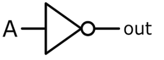

# NOT Gate

#### Brief Description

A NOT gate, also known as an inverter, is a fundamental digital logic gate that implements logical negation. It outputs true or high (1) when its input is false or low (0) and vice versa. The NOT gate effectively inverts the input signal.

**Symbol:**



**Truth Table:**

| A | Y |
|---|---|
| 0 | 1 |
| 1 | 0 |

In Verilog, there are several ways to implement a NOT gate. Here are a few methods:

#### Implementation Methods

1. **Using `assign` Statement:**
   This is the most straightforward way to implement a NOT gate in Verilog using continuous assignment.

   > [not_gate_assign](not_gate_assign.v)


2. **Using `always` Block:**
   The `always` block is used for procedural assignments. This method is more illustrative for learning and complex logic, although not typical for simple gates.

   > [not_gate_always](not_gate_always.v)

3. **Using Behavioral Modeling:**
   This method leverages behavioral modeling, which is more descriptive and often used in higher-level design.

   > [not_gate_behavioral](not_gate_behavioral.v)

4. **Using Gate-Level Primitives:**
   Verilog provides built-in primitives for basic gates. Here’s how you can use the `not` primitive.

   > [not_gate_primitive](not_gate_primitive.v)

Each method has its specific use case depending on the complexity of the design and the designer’s preference. For simple gates, the `assign` statement is most commonly used due to its simplicity and clarity. For more complex designs, other methods like `always` blocks or behavioral modeling might be more appropriate.


#### Special Properties of the NOT Gate

The NOT gate, while simple, has several notable properties and uses:

1. **Logical Inversion:**
   - The primary function of the NOT gate is to invert the logic level of its input. If the input is 1 (high), the output will be 0 (low), and vice versa.

2. **Idempotent Law:**
   - Applying a NOT gate twice in series results in the original value, i.e., `NOT(NOT(A)) = A`.

   ```verilog
   module double_not (
       input wire a,
       output wire y
   );
       wire not_a;
       assign not_a = ~a;
       assign y = ~not_a;
   endmodule
   ```

3. **De Morgan’s Theorem:**
   - The NOT gate is crucial in De Morgan's laws, which are fundamental for simplifying logic circuits:
     - `NOT(A AND B) = (NOT A) OR (NOT B)`
     - `NOT(A OR B) = (NOT A) AND (NOT B)`

4. **Inverter Chains and Signal Conditioning:**
   - In digital circuits, chains of inverters can be used to introduce delays or to stabilize signals. This can be useful for timing adjustments.

5. **Signal Restoration:**
   - Inverters can restore signals to their full logic levels after they have been degraded by noise or other factors.

6. **Oscillators:**
   - A NOT gate can be used in combination with other components (like resistors and capacitors) to create simple oscillators, such as a ring oscillator.
