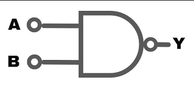

# NAND Gate

#### Brief Description

A NAND gate is a fundamental digital logic gate that implements logical negation of an AND gate. It outputs false or low (0) only if all of its inputs are true or high (1). If any input is false or low (0), the output is true or high. In essence, the NAND gate performs the negated multiplication operation in binary logic.

**Symbol:**

**Truth Table:**

| A | B | Y |
|---|---|---|
| 0 | 0 | 1 |
| 0 | 1 | 1 |
| 1 | 0 | 1 |
| 1 | 1 | 0 |

In Verilog, there are several ways to implement a NAND gate. Here are a few methods:

#### Implementation Methods

1. **Using `assign` Statement:**
   This is the most straightforward way to implement a NAND gate in Verilog using continuous assignment.

   > [nand_gate_assign](nand_gate_assign.v)

2. **Using `always` Block:**
   The `always` block is used for procedural assignments. This method is more illustrative for learning and complex logic, although not typical for simple gates.

   > [nand_gate_always](nand_gate_always.v)

3. **Using Behavioral Modeling:**
   This method leverages behavioral modeling, which is more descriptive and often used in higher-level design.

   > [nand_gate_behavioral](nand_gate_behavioral.v)

4. **Using Gate-Level Primitives:**
   Verilog provides built-in primitives for basic gates. Here’s how you can use the `not` primitive.

   > [nand_gate_primitive](nand_gate_primitive.v)

Each method has its specific use case depending on the complexity of the design and the designer’s preference. For simple gates, the `assign` statement is most commonly used due to its simplicity and clarity. For more complex designs, other methods like `always` blocks or behavioral modeling might be more appropriate.

## Properties of NAND Gate

A NAND gate is a fundamental digital logic gate that outputs false or low (0) only when all its inputs are true or high. It is the complement of the AND gate. Here are some key properties:

### Idempotent Law
- **Formula:** `A NAND A = NOT(A)`
  - **Example:** If `A = 1`, then `1 NAND 1 = 0`.

### Identity Law
- **Formula:** `A NAND 1 = NOT(A)`
  - **Example:** If `A = 0`, then `0 NAND 1 = 1`.

### Domination Law
- **Formula:** `A NAND 0 = 1`
   - **Example:** Regardless of `A`, the result is always 1.

### Commutative Law
- **Formula:** `A NAND B = B NAND A`
  - **Example:** `0 NAND 1 = 1 NAND 0 = 1`.

### Associative Law
- **Formula:** `(A NAND B) NAND C = A NAND (B NAND C)`
  - **Example:** `(1 NAND 0) NAND 1 = 1 NAND (0 NAND 1) = 0`.

### Distributive Law
- **Formula:** `A NAND (B OR C) = (A NAND B) AND (A NAND C)`
  - **Example:** `1 NAND (0 OR 1) = (1 NAND 0) AND (1 NAND 1) = 1 AND 0 = 0`.

### Absorption Law
- **Formula:** `A NAND (A AND B) = NOT(A)`
  - **Example:** `1 NAND (1 AND 0) = NOT(1) = 0`.

### Negation Law
- **Formula:** `A NAND NOT(A) = 1`
  - **Example:** If `A = 0`, then `0 NAND NOT(0) = 0 NAND 1 = 1`.

These properties are essential in digital logic design and are used to simplify and analyze complex logic circuits.

## Universal Gate Properties of NAND Gate

The NAND gate is known as a universal gate because any logic circuit can be implemented using only NAND gates. Here are some key properties:

### Inversion (NOT Gate)
- **Formula:** `A NAND A = NOT(A)`
- **Example:** If `A = 1`, then `1 NAND 1 = 0`.

### AND Gate
- **Formula:** `(A NAND B) NAND (A NAND B) = A AND B`
- **Example:** If `A = 1` and `B = 0`, then `(1 NAND 0) NAND (1 NAND 0) = 0 NAND 0 = 1`.

### OR Gate
- **Formula:** `(A NAND A) NAND (B NAND B) = A OR B`
- **Example:** If `A = 0` and `B = 1`, then `(0 NAND 0) NAND (1 NAND 1) = 1 NAND 0 = 1`.

### NOR Gate
- **Formula:** `((A NAND A) NAND (B NAND B)) NAND ((A NAND A) NAND (B NAND B)) = A NOR B`
- **Example:** If `A = 0` and `B = 1`, then `((0 NAND 0) NAND (1 NAND 1)) NAND ((0 NAND 0) NAND (1 NAND 1)) = 1 NAND 1 = 0`.

These properties illustrate the versatility of the NAND gate in constructing any other type of gate, making it a fundamental building block in digital electronics.