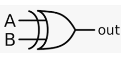

# XOR Gate
### Brief Description

An XOR (Exclusive OR) gate is a digital logic gate that outputs true or high (1) only when the number of true or high inputs is odd. It essentially performs the addition of two binary digits without carrying.
The XOR gate is widely used in arithmetic circuits, error detection, and data processing systems. Its unique behavior of outputting true only when inputs differ makes it crucial in various digital applications.
```math
 A \oplus B = A\overline{B} + \overline{A}B
```
**Symbol:**



| A | B | Q|
| --- | --- | --- |
| 0 | 0 | 0|
| 0 | 1 | 1|
| 1 | 0 | 1|
| 1 | 1 | 0|

In Verilog, there are several ways to implement an XOR gate. Here are a few methods:

### Implementation Methods
**1. Using assign Statement:**

This is the most straightforward way to implement an XOR gate in Verilog using continuous assignment.

[xor_gate](xor_gate.v) is implemented using assign statement.

**2. Using always Block:**

The always block is used for procedural assignments. This is not typical for a simple Xor gate but is useful for learning purposes and more complex logic.

[xor_gate_always](xor_gate_always.v) is implemented using always block.

**3. Using Behavioral Modeling:**

This method called behavioral modeling, which is more descriptive and often used in higher-level design.

[xor_gate_behavioral](xor_gate_behavioral.v) is implemented using Behavioral modeling.

**4. Using Gate-Level Modeling:**

Verilog provides built-in primitives for basic gates. Keyword like `and` can be use for gate implementation.

[xor_gate_primitive](xor_gate_primitive.v) is implemented using Gate-Level modeling.

**5. Using Generate Statements:**

Generate statements are useful for creating multiple instances of a gate, often used in more complex designs.

[xor_gate_generate](xor_gate_generate.v) is implemented using Generate.

> Each method has its use case depending on the complexity of the design and the designer’s preference. For simple gates, the `assign` statement is most commonly used due to its simplicity and clarity. For more complex designs, other methods like always blocks, behavioral modeling, or generate statements might be more appropriate.


# Properties of XOR Gate


## Idempotent Law
- **Formula:** `A XOR A = 0`
- **Example:** If `A = 1`, then `1 XOR 1 = 0`.

## Identity Law
- **Formula:** `A XOR 0 = A`
- **Example:** If `A = 0`, then `0 XOR 0 = 0`.

## Domination Law
- **Formula:** `A XOR 1 = NOT(A)`
- **Example:** If `A = 1`, then `1 XOR 1 = 0`.

## Commutative Law
- **Formula:** `A XOR B = B XOR A`
- **Example:** `0 XOR 1 = 1 XOR 0 = 1`.

## Associative Law
- **Formula:** `(A XOR B) XOR C = A XOR (B XOR C)`
- **Example:** `(1 XOR 0) XOR 1 = 1 XOR (0 XOR 1) = 0`.

## Distributive Law
- **Formula:** `A XOR (B AND C) = (A XOR B) AND (A XOR C)`
- **Example:** `1 XOR (0 AND 1) = (1 XOR 0) AND (1 XOR 1) = 1 AND 0 = 0`.

## Absorption Law
- **Formula:** `A XOR (A AND B) = A AND NOT(B)`
- **Example:** `1 XOR (1 AND 0) = 1 AND NOT(0) = 1`.

## Negation Law
- **Formula:** `A XOR NOT(A) = 1`
- **Example:** If `A = 0`, then `0 XOR NOT(0) = 0 XOR 1 = 1`.

These properties are essential in digital logic design and are used to simplify and analyze complex logic circuits.
