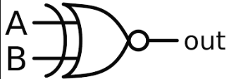

# XNOR Gate

#### Brief Description

An XNOR (Exclusive NOR) gate is a digital logic gate that outputs true or high (1) only when the number of true or high inputs is even. It essentially performs comparing of 2 bits, whether equal or not.

> A ⨀ B = A'B' + AB

**Symbol:**
 

**Truth Table:**

| A | B | Y |
|---|---|---|
| 0 | 0 | 0 |
| 0 | 1 | 1 |
| 1 | 0 | 1 |
| 1 | 1 | 0 |

In Verilog, there are several ways to implement an XNOR gate. Here are a few methods:

#### Implementation Methods

1. **Using `assign` Statement:**
   
   This is the most straightforward way to implement an XNOR gate in Verilog using continuous assignment.

   > [xnor_gate.v](xnor_gate.v)

2. **Using `always` Block:**
   
   The `always` block is used for procedural assignments. This method is more illustrative for learning and complex logic, although not typical for simple gates.

   > [xnor_gate_always](xnor_gate_always.v)

3. **Using Behavioral Modeling:**
   This method leverages behavioral modeling, which is more descriptive and often used in higher-level design.

   > [xnor_gate_behavioral](xnor_gate_behavioral.v)

4. **Using Gate-Level Primitives:**
   Verilog provides built-in primitives for basic gates. Here’s how you can use the `xnor` primitive.

   > [xnor_gate_primitive](xnor_gate_primitive.v)

5. **Using Generate Statements:**
   Generate statements are useful for creating multiple instances of a gate, often used in more complex designs.

   > [xnor_gate_generate](xnor_gate_generate.v)

### Properties of XNOR Gate

An XNOR (Exclusive NOR) gate is a digital logic gate that outputs true or high (1) only when the number of true or high inputs is even. It is the complement of the XOR gate. Here are some key properties:

## Idempotent Law
- **Formula:** `A XNOR A = 1`
- **Example:** If `A = 1`, then `1 XNOR 1 = 1`.

## Identity Law
- **Formula:** `A XNOR 0 = NOT(A)`
- **Example:** If `A = 0`, then `0 XNOR 0 = 1`.

## Domination Law
- **Formula:** `A XNOR 1 = A`
- **Example:** If `A = 0`, then `0 XNOR 1 = 0`.

## Commutative Law
- **Formula:** `A XNOR B = B XNOR A`
- **Example:** `0 XNOR 1 = 1 XNOR 0 = 0`.

## Associative Law
- **Formula:** `(A XNOR B) XNOR C = A XNOR (B XNOR C)`
- **Example:** `(1 XNOR 0) XNOR 1 = 1 XNOR (0 XNOR 1) = 1`.

## Distributive Law
- **Formula:** `A XNOR (B AND C) = (A XNOR B) OR (A XNOR C)`
- **Example:** `1 XNOR (0 AND 1) = (1 XNOR 0) OR (1 XNOR 1) = 0 OR 1 = 1`.

## Absorption Law
- **Formula:** `A XNOR (A OR B) = NOT(B)`
- **Example:** `1 XNOR (1 OR 0) = NOT(0) = 1`.

## Negation Law
- **Formula:** `A XNOR NOT(A) = 0`
- **Example:** If `A = 0`, then `0 XNOR NOT(0) = 0 XNOR 1 = 0`.

These properties are crucial in digital logic design and are used to simplify and analyze complex logic circuits.
