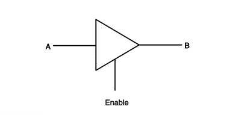

# Tri-State Buffer

## Description
A tri-state buffer, also known as a three-state buffer, is a digital circuit that can have three possible output states:
1. Logic high (1)
2. Logic low (0)
3. High impedance (Z)

The high impedance state effectively disconnects the output from the circuit, allowing multiple tri-state buffers to share a common bus without conflict.



## Functionality
- Inputs: 
  - Data input
  - Enable (or control) input
- Output: 
  - Data output (which can be in one of three states)

When the enable input is active, the buffer acts like a normal buffer, passing the input to the output. When the enable input is inactive, the output goes into a high impedance state, effectively disconnecting it from the circuit.

## Truth Table
| Enable | Input | Output |
|--------|-------|--------|
| 0      | X     | Z      |
| 1      | 0     | 0      |
| 1      | 1     | 1      |

(X represents "don't care" and Z represents high impedance)

## Verilog Implementation

```verilog
module tri_state_buffer (
    input wire data_in,
    input wire enable,
    output wire data_out
);

assign data_out = enable ? data_in : 1'bz;

endmodule
```
[find the code here.](tri_state_bufffer.v)

## Design Explanation

The module has two inputs: `data_in` and `enable`.

It has one output: `data_out`.

The ternary operator (?:) is used to implement the tri-state logic:

If enable is 1, `data_out` is assigned the value of `data_in`.
If enable is 0, `data_out` is assigned 1'bz, which represents high impedance in Verilog.


### Simulating High Impedance
In simulation, the high impedance state (Z) is typically represented as a special value. However, in real hardware, it means the output is effectively disconnected from the circuit.

### Applications
Tri-state buffers are widely used in digital systems, particularly in:

- Bus systems: Multiple devices can share a common bus without conflict.
- Memory systems: To connect multiple memory chips to a single data bus.
- Microprocessor systems: For managing bidirectional data lines.
- I/O ports: To control when a device can drive an output line.

### Advantages

- Allows multiple outputs to be connected to a single wire (bus).
- Reduces the number of connections needed in complex digital systems.
- Enables bidirectional communication on a single line.

### Challenges in Usage

- Timing: Ensuring proper enable/disable timing to avoid bus contention.
- Floating inputs: Properly managing high impedance states to avoid floating inputs in the receiving circuits.