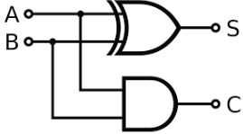

# Half Adder

A half adder is a fundamental digital circuit used to add two single-bit binary numbers. It produces two outputs: the sum (S) and the carry (C). The sum is the result of the addition, and the carry is the overflow bit that will be carried to the next higher bit position.

#### Symbol



#### Truth Table
| A | B | Sum (S) | Carry (C) |
|---|---|---------|-----------|
| 0 | 0 |    0    |     0     |
| 0 | 1 |    1    |     0     |
| 1 | 0 |    1    |     0     |
| 1 | 1 |    0    |     1     |

#### Verilog Implementations

**1. Basic Implementation:**
```verilog
module half_adder (
    input A,
    input B,
    output Sum,
    output Carry
);
    assign Sum = A ^ B;    // XOR for sum
    assign Carry = A & B;  // AND for carry
endmodule
```
[half_adder.v](half_adder.v)

**2. Using Behavioral Modeling:**
```verilog
module half_adder (
    input A,
    input B,
    output reg Sum,
    output reg Carry
);
    always @(*) begin
        Sum = A ^ B;    // XOR for sum
        Carry = A & B;  // AND for carry
    end
endmodule
```
[half_adder_behav.v](half_adder_behav.v)

**3. Using Structural Modeling:**
```verilog
module xor_gate (
    input A,
    input B,
    output Y
);
    assign Y = A ^ B;
endmodule

module and_gate (
    input A,
    input B,
    output Y
);
    assign Y = A & B;
endmodule

module half_adder (
    input A,
    input B,
    output Sum,
    output Carry
);
    xor_gate XOR1 (.A(A), .B(B), .Y(Sum));
    and_gate AND1 (.A(A), .B(B), .Y(Carry));
endmodule
```
[half_adder_struc.v](half_adder_struc.v)

**4. Gate-Level Modeling:**
```verilog
module half_adder (
    input A,
    input B,
    output Sum,
    output Carry
);
    xor (Sum, A, B);   // XOR gate for sum
    and (Carry, A, B); // AND gate for carry
endmodule
```
[half_adder_gate.v](halh_adder_gate.v)

These Verilog implementations showcase different modeling techniques: dataflow, behavioral, and structural, allowing you to understand and utilize half adders in various digital design contexts.