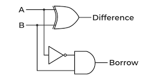

# Half Subtractor

A half subtractor is a combinational circuit that subtracts one binary digit from another, producing a difference and a borrow output. It is used in arithmetic circuits and is a basic building block for digital subtraction operations.


#### Symbol



#### Truth Table
| A | B | Difference (D) | Borrow (Bout) |
|---|---|----------------|---------------|
| 0 | 0 |        0       |       0       |
| 0 | 1 |        1       |       1       |
| 1 | 0 |        1       |       0       |
| 1 | 1 |        0       |       0       |

#### Verilog Implementations

**1. Basic Implementation:**
```verilog
module half_subtractor (
    input A,
    input B,
    output Difference,
    output Borrow
);
    assign Difference = A ^ B;  // XOR for difference
    assign Borrow = ~A & B;     // AND and NOT for borrow
endmodule
```
[half_sub.v](half_sub.v)

**2. Using Behavioral Modeling:**
```verilog
module half_subtractor (
    input A,
    input B,
    output reg Difference,
    output reg Borrow
);
    always @(*) begin
        Difference = A ^ B;  // XOR for difference
        Borrow = ~A & B;     // AND and NOT for borrow
    end
endmodule
```
[half_sub_behav.v](half_sub_behav.v)

**3. Using Structural Modeling:**
```verilog
module xor_gate (
    input A,
    input B,
    output Y
);
    assign Y = A ^ B;
endmodule

module and_gate (
    input A,
    input B,
    output Y
);
    assign Y = A & B;
endmodule

module not_gate (
    input A,
    output Y
);
    assign Y = ~A;
endmodule

module half_subtractor (
    input A,
    input B,
    output Difference,
    output Borrow
);
    wire NotA, Borrow_intermediate;

    xor_gate XOR1 (.A(A), .B(B), .Y(Difference));
    not_gate NOT1 (.A(A), .Y(NotA));
    and_gate AND1 (.A(NotA), .B(B), .Y(Borrow_intermediate));
    assign Borrow = Borrow_intermediate;
endmodule
```
[half_sub_struc.v](half_sub_struc.v)

**4. Using Gate-Level Modeling:**
```verilog
module half_subtractor (
    input A,
    input B,
    output Difference,
    output Borrow
);
    wire NotA;

    xor (Difference, A, B);  // XOR gate for difference
    not (NotA, A);           // NOT gate for A
    and (Borrow, NotA, B);   // AND gate for borrow
endmodule
```
[half_sub_gate.v](half_sub_gate.v)

These Verilog implementations showcase different modeling techniques: dataflow, behavioral, structural, and gate-level, allowing you to understand and utilize half subtractors in various digital design contexts.