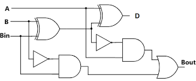

# Full Subtractor

A full subtractor is a combinational circuit that subtracts one binary digit (B) and a borrow bit (Bin) from another binary digit (A), producing a difference (D) and a borrow out (Bout). It is used in digital circuits for subtraction operations involving multiple bits.

#### Symbol



#### Truth Table
| A | B | Bin | Difference (D) | Borrow (Bout) |
|---|---|-----|----------------|---------------|
| 0 | 0 |  0  |        0       |       0       |
| 0 | 0 |  1  |        1       |       1       |
| 0 | 1 |  0  |        1       |       1       |
| 0 | 1 |  1  |        0       |       1       |
| 1 | 0 |  0  |        1       |       0       |
| 1 | 0 |  1  |        0       |       0       |
| 1 | 1 |  0  |        0       |       0       |
| 1 | 1 |  1  |        1       |       1       |

#### Verilog Implementations

**1. Basic Implementation:**
```verilog
module full_subtractor (
    input A,
    input B,
    input Bin,
    output Difference,
    output Borrow
);
    assign Difference = A ^ B ^ Bin;                   // XOR for difference
    assign Borrow = (~A & (B | Bin)) | (B & Bin);      // Borrow logic
endmodule
```
[full_subtractor](full_subtractor.v)

**2. Using Behavioral Modeling:**
```verilog
module full_subtractor (
    input A,
    input B,
    input Bin,
    output reg Difference,
    output reg Borrow
);
    always @(*) begin
        Difference = A ^ B ^ Bin;                    // XOR for difference
        Borrow = (~A & (B | Bin)) | (B & Bin);       // Borrow logic
    end
endmodule
```
[full_subtractor_behav](full_sub_behav.v)

**3. Using Structural Modeling:**
```verilog
module half_subtractor (
    input A,
    input B,
    output Difference,
    output Borrow
);
    assign Difference = A ^ B;  // XOR for difference
    assign Borrow = ~A & B;     // AND and NOT for borrow
endmodule

module full_subtractor (
    input A,
    input B,
    input Bin,
    output Difference,
    output Borrow
);
    wire Diff1, Borrow1, Borrow2;

    half_subtractor HS1 (.A(A), .B(B), .Difference(Diff1), .Borrow(Borrow1));
    half_subtractor HS2 (.A(Diff1), .B(Bin), .Difference(Difference), .Borrow(Borrow2));

    assign Borrow = Borrow1 | Borrow2; // OR gate for final borrow
endmodule
```
[full_sub_strac](full_sub_strac.v)

**4. Using Gate-Level Modeling:**
```verilog
module full_subtractor (
    input A,
    input B,
    input Bin,
    output Difference,
    output Borrow
);
    wire Diff1, Borrow1, Borrow2;

    xor (Diff1, A, B);          // First XOR for intermediate difference
    xor (Difference, Diff1, Bin); // Second XOR for final difference
    and (Borrow1, ~A, B);       // First AND for borrow
    and (Borrow2, ~Diff1, Bin); // Second AND for borrow

    or (Borrow, Borrow1, Borrow2); // OR gate for final borrow
endmodule
```
[full_sub_gate.v](full_sub_gate.v)

These Verilog implementations showcase different modeling techniques: dataflow, behavioral, structural, and gate-level, allowing you to understand and utilize full subtractors in various digital design contexts.