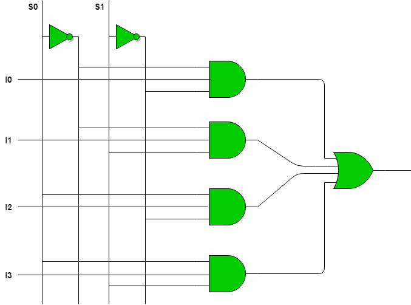

## 4-to-1 Multiplexer

A 4-to-1 multiplexer (MUX) is a combinational circuit that selects one of the four input signals based on a two-bit select signal and forwards the selected input to the output. This multiplexer is widely used in digital systems for data routing and selection purposes.

#### Description
- **Inputs:**
  - `I0`, `I1`, `I2`, `I3`: Data inputs.
  - `S0`, `S1`: Select inputs.
- **Output:**
  - `Y`: Output that reflects the selected input.

#### Working
- The output `Y` is determined by the select lines `S0` and `S1`.
  - When `S1S0` is `00`, `Y` is `I0`.
  - When `S1S0` is `01`, `Y` is `I1`.
  - When `S1S0` is `10`, `Y` is `I2`.
  - When `S1S0` is `11`, `Y` is `I3`.
#### Circuit



#### Use Cases
- **Data Selection:** Selecting one of the multiple data sources.
- **Signal Routing:** Directing signals to different parts of a circuit.
- **Arithmetic Operations:** Used in arithmetic logic units (ALUs).
- **Memory Addressing:** Selecting memory addresses in memory management.

### Verilog Implementations

**1. Using Dataflow Modeling:**
```verilog
module mux4to1 (
    input I0,
    input I1,
    input I2,
    input I3,
    input S0,
    input S1,
    output Y
);
    assign Y = (S1 ? (S0 ? I3 : I2) : (S0 ? I1 : I0));
endmodule
```
[dataflow.v](dataflow.v)

**2. Using Behavioral Modeling:**
```verilog
module mux4to1 (
    input I0,
    input I1,
    input I2,
    input I3,
    input S0,
    input S1,
    output reg Y
);
    always @(*) begin
        case ({S1, S0})
            2'b00: Y = I0;
            2'b01: Y = I1;
            2'b10: Y = I2;
            2'b11: Y = I3;
            default: Y = 0;
        endcase
    end
endmodule
```
[behavioral.v](behavioral.v)

**3. Using Structural Modeling:**
```verilog
module mux4to1 (
    input I0,
    input I1,
    input I2,
    input I3,
    input S0,
    input S1,
    output Y
);
    wire nS0, nS1;
    wire Y0, Y1, Y2, Y3;

    not (nS0, S0);
    not (nS1, S1);

    and (Y0, I0, nS1, nS0);
    and (Y1, I1, nS1, S0);
    and (Y2, I2, S1, nS0);
    and (Y3, I3, S1, S0);

    or (Y, Y0, Y1, Y2, Y3);
endmodule
```
[structural.v](structural.v)

**4. Using Gate-Level Modeling:**
```verilog
module mux4to1 (
    input I0,
    input I1,
    input I2,
    input I3,
    input S0,
    input S1,
    output Y
);
    assign Y = (I0 & ~S1 & ~S0) | (I1 & ~S1 & S0) | (I2 & S1 & ~S0) | (I3 & S1 & S0);
endmodule
```
[gatelevel.v](gatelevel.v)

#### Testbench
```verilog
module test_mux4to1;
    reg I0;
    reg I1;
    reg I2;
    reg I3;
    reg S0;
    reg S1;
    wire Y;

    mux4to1 uut (
        .I0(I0),
        .I1(I1),
        .I2(I2),
        .I3(I3),
        .S0(S0),
        .S1(S1),
        .Y(Y)
    );

    initial begin
        $monitor("I0=%b, I1=%b, I2=%b, I3=%b, S1=%b, S0=%b, Y=%b", I0, I1, I2, I3, S1, S0, Y);

        // Test case 1: S1S0=00, I0=0, I1=0, I2=0, I3=0
        I0 = 0; I1 = 0; I2 = 0; I3 = 0; S1 = 0; S0 = 0;
        #10;

        // Test case 2: S1S0=00, I0=1, I1=0, I2=0, I3=0
        I0 = 1; I1 = 0; I2 = 0; I3 = 0; S1 = 0; S0 = 0;
        #10;

        // Test case 3: S1S0=01, I0=0, I1=1, I2=0, I3=0
        I0 = 0; I1 = 1; I2 = 0; I3 = 0; S1 = 0; S0 = 1;
        #10;

        // Test case 4: S1S0=10, I0=0, I1=0, I2=1, I3=0
        I0 = 0; I1 = 0; I2 = 1; I3 = 0; S1 = 1; S0 = 0;
        #10;

        // Test case 5: S1S0=11, I0=0, I1=0, I2=0, I3=1
        I0 = 0; I1 = 0; I2 = 0; I3 = 1; S1 = 1; S0 = 1;
        #10;

        $finish;
    end
endmodule
```
[testbench.v](testbench.v)
