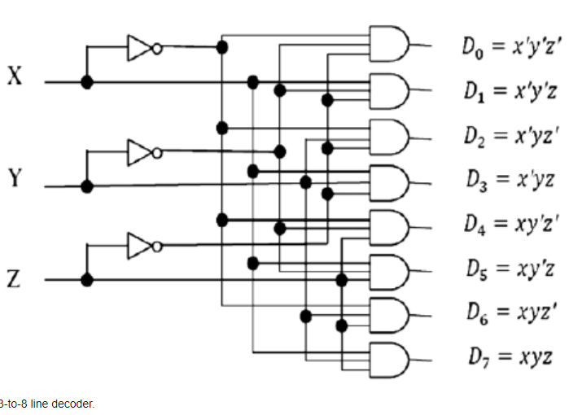

# 3-to-8 Decoder

A 3-to-8 decoder is a combinational circuit that decodes a 3-bit binary input into one of eight outputs, with only one output being high (1) at any given time. This type of decoder is essential for selecting one of many outputs in digital systems.

#### Description
- **Inputs:**
  - `A0`, `A1`, `A2`: Binary select inputs.
  - `EN`: Enable input.
- **Outputs:**
  - `Y0`, `Y1`, `Y2`, `Y3`, `Y4`, `Y5`, `Y6`, `Y7`: Outputs, where only one is high based on the inputs.

#### Working
- The output `Y` is determined by the binary combination of inputs `A0`, `A1`, and `A2`.
  - When `EN` is `1`:
    - `A2A1A0` = `000` sets `Y0` = `1`
    - `A2A1A0` = `001` sets `Y1` = `1`
    - `A2A1A0` = `010` sets `Y2` = `1`
    - `A2A1A0` = `011` sets `Y3` = `1`
    - `A2A1A0` = `100` sets `Y4` = `1`
    - `A2A1A0` = `101` sets `Y5` = `1`
    - `A2A1A0` = `110` sets `Y6` = `1`
    - `A2A1A0` = `111` sets `Y7` = `1`
- If `EN` is `0`, all outputs are `0`.

#### Circuit



#### Use Cases
- **Memory Addressing:** Selecting memory locations.
- **Signal Routing:** Directing signals in a circuit.
- **Control Units:** Used in control units for selecting operations.

## Verilog Implementations

**1. Using Dataflow Modeling:**
```verilog
module decoder3to8 (
    input A0,
    input A1,
    input A2,
    input EN,
    output Y0,
    output Y1,
    output Y2,
    output Y3,
    output Y4,
    output Y5,
    output Y6,
    output Y7
);
    assign Y0 = EN & ~A2 & ~A1 & ~A0;
    assign Y1 = EN & ~A2 & ~A1 & A0;
    assign Y2 = EN & ~A2 & A1 & ~A0;
    assign Y3 = EN & ~A2 & A1 & A0;
    assign Y4 = EN & A2 & ~A1 & ~A0;
    assign Y5 = EN & A2 & ~A1 & A0;
    assign Y6 = EN & A2 & A1 & ~A0;
    assign Y7 = EN & A2 & A1 & A0;
endmodule
```
[File here](dataflow.v)💬

**2. Using Behavioral Modeling:**
```verilog
module decoder3to8 (
    input A0,
    input A1,
    input A2,
    input EN,
    output reg Y0,
    output reg Y1,
    output reg Y2,
    output reg Y3,
    output reg Y4,
    output reg Y5,
    output reg Y6,
    output reg Y7
);
    always @(*) begin
        if (EN) begin
            case ({A2, A1, A0})
                3'b000: {Y7, Y6, Y5, Y4, Y3, Y2, Y1, Y0} = 8'b00000001;
                3'b001: {Y7, Y6, Y5, Y4, Y3, Y2, Y1, Y0} = 8'b00000010;
                3'b010: {Y7, Y6, Y5, Y4, Y3, Y2, Y1, Y0} = 8'b00000100;
                3'b011: {Y7, Y6, Y5, Y4, Y3, Y2, Y1, Y0} = 8'b00001000;
                3'b100: {Y7, Y6, Y5, Y4, Y3, Y2, Y1, Y0} = 8'b00010000;
                3'b101: {Y7, Y6, Y5, Y4, Y3, Y2, Y1, Y0} = 8'b00100000;
                3'b110: {Y7, Y6, Y5, Y4, Y3, Y2, Y1, Y0} = 8'b01000000;
                3'b111: {Y7, Y6, Y5, Y4, Y3, Y2, Y1, Y0} = 8'b10000000;
                default: {Y7, Y6, Y5, Y4, Y3, Y2, Y1, Y0} = 8'b00000000;
            endcase
        end else begin
            {Y7, Y6, Y5, Y4, Y3, Y2, Y1, Y0} = 8'b00000000;
        end
    end
endmodule
```
[File here](behavioral.v)💬

**3. Using Structural Modeling:**
```verilog
module decoder3to8 (
    input A0,
    input A1,
    input A2,
    input EN,
    output Y0,
    output Y1,
    output Y2,
    output Y3,
    output Y4,
    output Y5,
    output Y6,
    output Y7
);
    wire nA0, nA1, nA2;

    not (nA0, A0);
    not (nA1, A1);
    not (nA2, A2);

    and (Y0, EN, nA2, nA1, nA0);
    and (Y1, EN, nA2, nA1, A0);
    and (Y2, EN, nA2, A1, nA0);
    and (Y3, EN, nA2, A1, A0);
    and (Y4, EN, A2, nA1, nA0);
    and (Y5, EN, A2, nA1, A0);
    and (Y6, EN, A2, A1, nA0);
    and (Y7, EN, A2, A1, A0);
endmodule
```
[File here](structural.v)💬

#### Testbench
```verilog
module test_decoder3to8;
    reg A0;
    reg A1;
    reg A2;
    reg EN;
    wire Y0;
    wire Y1;
    wire Y2;
    wire Y3;
    wire Y4;
    wire Y5;
    wire Y6;
    wire Y7;

    decoder3to8 uut (
        .A0(A0),
        .A1(A1),
        .A2(A2),
        .EN(EN),
        .Y0(Y0),
        .Y1(Y1),
        .Y2(Y2),
        .Y3(Y3),
        .Y4(Y4),
        .Y5(Y5),
        .Y6(Y6),
        .Y7(Y7)
    );

    initial begin
        $monitor("A2=%b, A1=%b, A0=%b, EN=%b, Y7=%b, Y6=%b, Y5=%b, Y4=%b, Y3=%b, Y2=%b, Y1=%b, Y0=%b", A2, A1, A0, EN, Y7, Y6, Y5, Y4, Y3, Y2, Y1, Y0);

        // Test all possible input combinations
        EN = 1;
        A2 = 0; A1 = 0; A0 = 0; #10;
        A2 = 0; A1 = 0; A0 = 1; #10;
        A2 = 0; A1 = 1; A0 = 0; #10;
        A2 = 0; A1 = 1; A0 = 1; #10;
        A2 = 1; A1 = 0; A0 = 0; #10;
        A2 = 1; A1 = 0; A0 = 1; #10;
        A2 = 1; A1 = 1; A0 = 0; #10;
        A2 = 1; A1 = 1; A0 = 1; #10;

        // Disable enable signal
        EN = 0; A2 = 0; A1 = 0; A0 = 0; #10;
    end
endmodule
```
[Testbench here](testbench.v)💬
