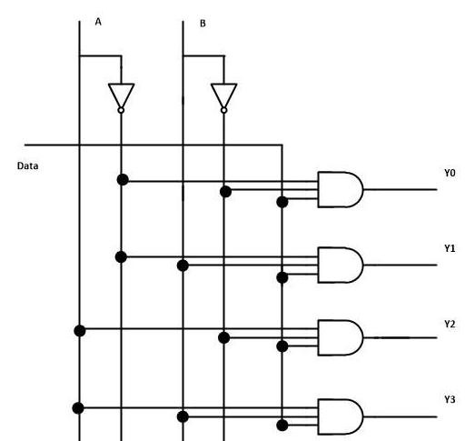

# 1-to-4 Demultiplexer

A 1-to-4 demultiplexer is a combinational circuit that takes a single input and distributes it to one of four outputs based on two select inputs. It essentially routes the input data to one of the outputs.

#### Description
- **Inputs:**
  - `D`: Data input.
  - `S0`, `S1`: Select inputs.
  - `EN`: Enable input.
- **Outputs:**
  - `Y0`, `Y1`, `Y2`, `Y3`: Outputs, where only one will carry the input data based on the select inputs.

#### Circuit



#### Working
- The demultiplexer routes the data input `D` to one of the four outputs `Y` based on the combination of the select inputs `S0` and `S1`.
  - When `EN` is `1`:
    - `S1S0` = `00` routes `D` to `Y0`
    - `S1S0` = `01` routes `D` to `Y1`
    - `S1S0` = `10` routes `D` to `Y2`
    - `S1S0` = `11` routes `D` to `Y3`
- If `EN` is `0`, all outputs are `0`.

#### Truth Table

| `S1` | `S0` | `D` | Y[3] | Y[2] | Y[1] | Y[0] |
|-----------|-----------|-------|-----------|-----------|-----------|-----------|
| 0         | 0         | 0     | 0         | 0         | 0         | 0         |
| 0         | 0         | 1     | 0         | 0         | 0         | 1         |
| 0         | 1         | 0     | 0         | 0         | 0         | 0         |
| 0         | 1         | 1     | 0         | 0         | 1         | 0         |
| 1         | 0         | 0     | 0         | 0         | 0         | 0         |
| 1         | 0         | 1     | 0         | 1         | 0         | 0         |
| 1         | 1         | 0     | 0         | 0         | 0         | 0         |
| 1         | 1         | 1     | 1         | 0         | 0         | 0         |


#### Use Cases
- **Data Routing:** Routing data from a single source to multiple destinations.
- **Control Units:** Used in control units to manage data flow.
- **Communication Systems:** Directing signals to different paths.

#### Verilog Implementations

**1. Using Dataflow Modeling:**
```verilog
module demux1to4 (
    input D,
    input S0,
    input S1,
    input EN,
    output Y0,
    output Y1,
    output Y2,
    output Y3
);
    assign Y0 = EN & D & ~S1 & ~S0;
    assign Y1 = EN & D & ~S1 & S0;
    assign Y2 = EN & D & S1 & ~S0;
    assign Y3 = EN & D & S1 & S0;
endmodule
```
[file here](dataflow.v) 👈🏼

**2. Using Behavioral Modeling:**
```verilog
module demux1to4 (
    input D,
    input S0,
    input S1,
    input EN,
    output reg Y0,
    output reg Y1,
    output reg Y2,
    output reg Y3
);
    always @(*) begin
        if (EN) begin
            case ({S1, S0})
                2'b00: {Y3, Y2, Y1, Y0} = {3'b000, D};
                2'b01: {Y3, Y2, Y1, Y0} = {3'b000, D} << 1;
                2'b10: {Y3, Y2, Y1, Y0} = {3'b000, D} << 2;
                2'b11: {Y3, Y2, Y1, Y0} = {3'b000, D} << 3;
                default: {Y3, Y2, Y1, Y0} = 4'b0000;
            endcase
        end else begin
            {Y3, Y2, Y1, Y0} = 4'b0000;
        end
    end
endmodule
```
[file here](behavioral.v) 👈🏼

**3. Using Structural Modeling:**
```verilog
module demux1to4 (
    input D,
    input S0,
    input S1,
    input EN,
    output Y0,
    output Y1,
    output Y2,
    output Y3
);
    wire nS0, nS1;

    not (nS0, S0);
    not (nS1, S1);

    and (Y0, EN, D, nS1, nS0);
    and (Y1, EN, D, nS1, S0);
    and (Y2, EN, D, S1, nS0);
    and (Y3, EN, D, S1, S0);
endmodule
```
[file here](structural.v) 👈🏼

#### Testbench
```verilog
module test_demux1to4;
    reg D;
    reg S0;
    reg S1;
    reg EN;
    wire Y0;
    wire Y1;
    wire Y2;
    wire Y3;

    demux1to4 uut (
        .D(D),
        .S0(S0),
        .S1(S1),
        .EN(EN),
        .Y0(Y0),
        .Y1(Y1),
        .Y2(Y2),
        .Y3(Y3)
    );

    initial begin
        $monitor("S1=%b, S0=%b, EN=%b, D=%b, Y3=%b, Y2=%b, Y1=%b, Y0=%b", S1, S0, EN, D, Y3, Y2, Y1, Y0);

        // Test all possible input combinations
        EN = 1; D = 1;
        S1 = 0; S0 = 0; #10;
        S1 = 0; S0 = 1; #10;
        S1 = 1; S0 = 0; #10;
        S1 = 1; S0 = 1; #10;

        // Disable enable signal
        EN = 0; S1 = 0; S0 = 0; D = 0; #10;
    end
endmodule
```
[Testbench file here](testbench.v) 👈🏼
