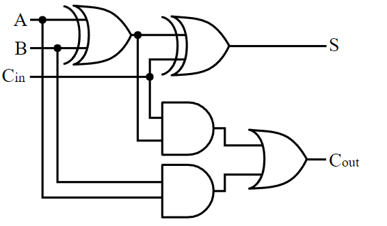

# Full Adder

A full adder is a digital circuit that adds three binary numbers (A, B, and Cin) and outputs a sum (S) and a carry (Cout). It can handle the carry input from a previous addition, making it a crucial component in constructing arithmetic circuits such as adders and subtractors.

#### Symbol



#### Truth Table
| A | B | Cin | Sum (S) | Carry (Cout) |
|---|---|-----|---------|--------------|
| 0 | 0 |  0  |    0    |      0       |
| 0 | 0 |  1  |    1    |      0       |
| 0 | 1 |  0  |    1    |      0       |
| 0 | 1 |  1  |    0    |      1       |
| 1 | 0 |  0  |    1    |      0       |
| 1 | 0 |  1  |    0    |      1       |
| 1 | 1 |  0  |    0    |      1       |
| 1 | 1 |  1  |    1    |      1       |

#### Verilog Implementations

**1. Basic Implementation:**
```verilog
module full_adder (
    input A,
    input B,
    input Cin,
    output Sum,
    output Cout
);
    assign Sum = A ^ B ^ Cin;    // XOR for sum
    assign Cout = (A & B) | (B & Cin) | (A & Cin);  // Carry logic
endmodule
```
[full_adder.v](full_adder.v)

**2. Using Behavioral Modeling:**
```verilog
module full_adder (
    input A,
    input B,
    input Cin,
    output reg Sum,
    output reg Cout
);
    always @(*) begin
        Sum = A ^ B ^ Cin;    // XOR for sum
        Cout = (A & B) | (B & Cin) | (A & Cin);  // Carry logic
    end
endmodule
```
[full_adder_behav.v](full_adder_behav.v)

**3. Using Structural Modeling:**
```verilog
module half_adder (
    input A,
    input B,
    output Sum,
    output Carry
);
    assign Sum = A ^ B;
    assign Carry = A & B;
endmodule

module full_adder (
    input A,
    input B,
    input Cin,
    output Sum,
    output Cout
);
    wire Sum1, Carry1, Carry2;

    half_adder HA1 (.A(A), .B(B), .Sum(Sum1), .Carry(Carry1));
    half_adder HA2 (.A(Sum1), .B(Cin), .Sum(Sum), .Carry(Carry2));

    assign Cout = Carry1 | Carry2;
endmodule
```
[full_adder_struc.v](full_adder_struc.v)

**4. Using Gate-Level Modeling:**
```verilog
module full_adder (
    input A,
    input B,
    input Cin,
    output Sum,
    output Cout
);
    wire Sum1, Carry1, Carry2;

    xor g1 (Sum1, A, B);     // First XOR for intermediate sum
    xor g2 (Sum, Sum1, Cin); // Second XOR for final sum
    and g3 (Carry1, A, B);   // First AND for carry
    and g4 (Carry2, Sum1, Cin); // Second AND for carry

    or g5 (Cout, Carry1, Carry2); // OR gate for final carry
endmodule
```
[full_adder_gate.v](full_adder_gate.v)

These Verilog implementations showcase different modeling techniques: dataflow, behavioral, structural, and gate-level, allowing you to understand and utilize full adders in various digital design contexts.