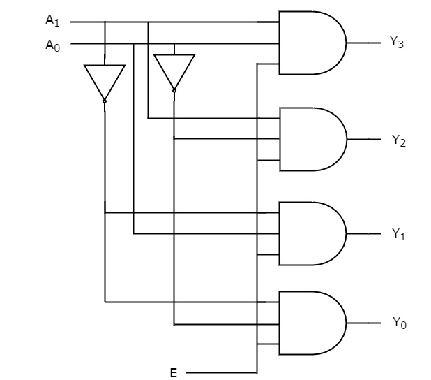

# 2-to-4 Decoder

A 2-to-4 decoder is a combinational circuit that decodes a 2-bit binary input into one of four outputs, with only one output being high (1) at any given time. This type of decoder is commonly used in digital systems for selecting one of several devices or lines.

#### Description
- **Inputs:**
  - `A0`, `A1`: Binary select inputs.
  - `EN`: Enable input.
- **Outputs:**
  - `Y0`, `Y1`, `Y2`, `Y3`: Outputs, where only one is high based on the inputs.

### Circiut



#### Working
- The output `Y` is determined by the binary combination of inputs `A0` and `A1`.
  - When `EN` is `1`:
    - `A1A0` = `00` sets `Y0` = `1`
    - `A1A0` = `01` sets `Y1` = `1`
    - `A1A0` = `10` sets `Y2` = `1`
    - `A1A0` = `11` sets `Y3` = `1`
- If `EN` is `0`, all outputs are `0`.

#### Use Cases
- **Memory Addressing:** Selecting memory locations.
- **Signal Routing:** Directing signals in a circuit.
- **Control Units:** Used in control units for selecting operations.

#### Verilog Implementations

**1. Using Dataflow Modeling:**
```verilog
module decoder2to4 (
    input A0,
    input A1,
    input EN,
    output Y0,
    output Y1,
    output Y2,
    output Y3
);
    assign Y0 = EN & ~A1 & ~A0;
    assign Y1 = EN & ~A1 & A0;
    assign Y2 = EN & A1 & ~A0;
    assign Y3 = EN & A1 & A0;
endmodule
```
[dataflow.v](dataflow.v)

**2. Using Behavioral Modeling:**
```verilog
module decoder2to4 (
    input A0,
    input A1,
    input EN,
    output reg Y0,
    output reg Y1,
    output reg Y2,
    output reg Y3
);
    always @(*) begin
        if (EN) begin
            case ({A1, A0})
                2'b00: {Y3, Y2, Y1, Y0} = 4'b0001;
                2'b01: {Y3, Y2, Y1, Y0} = 4'b0010;
                2'b10: {Y3, Y2, Y1, Y0} = 4'b0100;
                2'b11: {Y3, Y2, Y1, Y0} = 4'b1000;
                default: {Y3, Y2, Y1, Y0} = 4'b0000;
            endcase
        end else begin
            {Y3, Y2, Y1, Y0} = 4'b0000;
        end
    end
endmodule
```
[behavioral.v](behavioral.v)

**3. Using Structural Modeling:**
```verilog
module decoder2to4 (
    input A0,
    input A1,
    input EN,
    output Y0,
    output Y1,
    output Y2,
    output Y3
);
    wire nA0, nA1;

    not (nA0, A0);
    not (nA1, A1);

    and (Y0, EN, nA1, nA0);
    and (Y1, EN, nA1, A0);
    and (Y2, EN, A1, nA0);
    and (Y3, EN, A1, A0);
endmodule
```
[structural.v](structural.v)

#### Testbench
```verilog
module test_decoder2to4;
    reg A0;
    reg A1;
    reg EN;
    wire Y0;
    wire Y1;
    wire Y2;
    wire Y3;

    decoder2to4 uut (
        .A0(A0),
        .A1(A1),
        .EN(EN),
        .Y0(Y0),
        .Y1(Y1),
        .Y2(Y2),
        .Y3(Y3)
    );

    initial begin
        $monitor("A1=%b, A0=%b, EN=%b, Y3=%b, Y2=%b, Y1=%b, Y0=%b", A1, A0, EN, Y3, Y2, Y1, Y0);

        // Test all possible input combinations
        EN = 1;
        A1 = 0; A0 = 0; #10;
        A1 = 0; A0 = 1; #10;
        A1 = 1; A0 = 0; #10;
        A1 = 1; A0 = 1; #10;

        // Disable enable signal
        EN = 0; A1 = 0; A0 = 0; #10;
    end
endmodule
```
[testbench.v](teatbench.v)