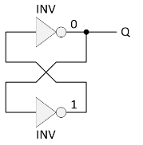
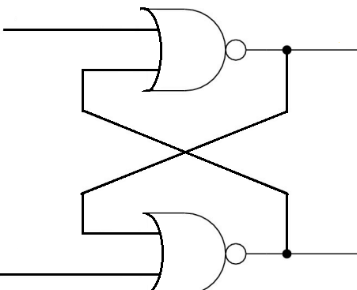
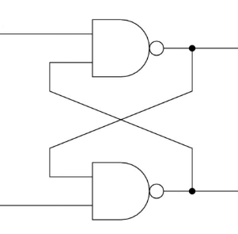
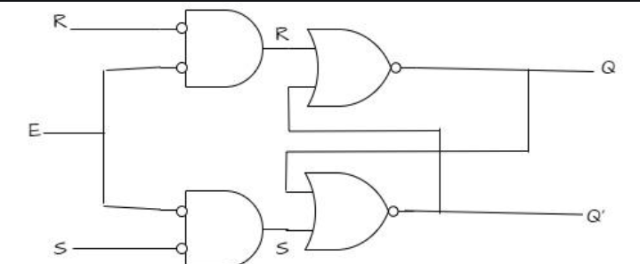

# SR Latch

The basic memory can be implemented cascaded combination of 2 inverters.

However, there is no input ports, and hence we don't have the control over the data stored.

let's try to modify this circuit either NAND or NOR

This is how **SR Latch** evolved. Latch is a one bit storage element cell which capable of retaining the past state output. 

| S   | R   | Q   | Qb  |
| --- | --- | --- | --- |
| 0   | 0   | Qn  | Qnb |
| 0   | 1   | 0   | 1   |
| 1   | 0   | 1   | 0   |
| 1   | 1   | 0   | 0   |

- Here is the [verilog code](sr_latch.v) and [testbench](sr_nor_tb.v) for a SR Latch using NOR Gate.
-  [verilog code](sr_nand.v) and [testbench](sr_nand_tb.v) for a SR Latch using NAND Gate.
  

## Gated SR Latch
A Gated SR latch is a SR latch with enable input which works when enable is 1 and retain the previous state when enable is 0. 

| Enable | S   | R   | Q   | Qb  |
| ------ | --- | --- | --- | --- |
| 0      | x   | x   | Qn  | Qnb |
| 1      | 0   | 0   | Qn  | Qnb |
| 1      | 0   | 1   | 0   | 1   |
| 1      | 1   | 0   | 1   | 0   |
| 1      | 1   | 1   | 0   | 0   |

