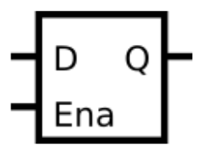

# D Latch

- Latches are level-sensitive (not edge-sensitive) circuits, so in an always block, they use level-sensitive sensitivity lists.
- However, they are still sequential elements, so should use non-blocking assignments.
- A D-latch acts like a wire (or non-inverting buffer) when enabled, and preserves the current value when disabled.

## Truth Table

| Enable | D   | Q   |
| ------ | --- | --- |
| 0      | x   | Q   |
| 1      | 0   | 0   |
| 1      | 1   | 1   |
