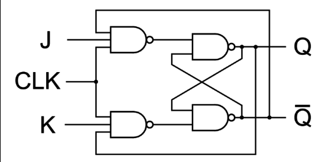

# JK Flip-flop

A JK flip-flop is a type of flip-flop, a fundamental building block in digital electronics used for storage and transfer of data. It is a versatile memory element that combines the properties of the SR (Set-Reset) flip-flop and eliminates the ambiguity when both inputs are high. The JK flip-flop has two inputs, J and K, and two outputs, Q and Q'. The state of the flip-flop changes according to the input values on the triggering edge of the clock signal:

| J   | K   | Q              | $\overline{Q}$ | Remarks   |
| --- | --- | -------------- | -------------- | --------- |
| 0   | 0   | Q              | $\overline{Q}$ | No change |
| 0   | 1   | 0              | 1              | Reset     |
| 1   | 0   | 1              | 0              | Set       |
| 1   | 1   | $\overline{Q}$ | Q              | Toggle    |

