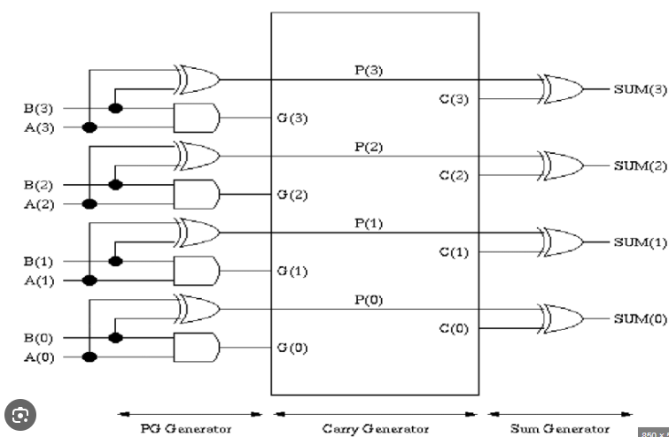

# Carry Look-Ahead Adder

A Carry Look-Ahead Adder (CLA) is a type of digital adder that improves speed by reducing the time it takes to calculate carry bits. Unlike a Ripple Carry Adder, where each carry bit depends on the previous one, a CLA adder generates carry signals in advance using two key concepts: **generate** and **propagate**.

- **Generate (G):** A carry is generated if both bits being added are 1.
- **Propagate (P):** A carry is propagated if at least one bit being added is 1.

The CLA uses these concepts to compute the carry signals more efficiently by calculating the carry for each bit position in parallel, rather than waiting for the carry from the previous bit. This results in faster addition, especially for large bit-width numbers, because the time complexity for carry computation is significantly reduced.

## Difference from Ripple Carry Adder

- **Speed:** The Ripple Carry Adder has a delay that increases linearly with the number of bits because each bit must wait for the carry from the previous bit. In contrast, the CLA computes all carries in parallel, leading to much faster addition.
  
- **Complexity:** The Ripple Carry Adder is simpler to implement but slower, while the CLA is more complex due to the additional logic required for carry look-ahead but is much faster.
  
- **Propagation Delay:** In a Ripple Carry Adder, the propagation delay increases with the number of bits, whereas, in a CLA, the delay is significantly reduced and does not depend as much on the number of bits.

```math
\large{ C_i = G_i +P_i \text{ } \cdot \text{ } C_{i-1}}\\
\text{ }\\
G_i = A_i \text{ } \cdot \text{ } \ B_i\\
P_i = A_i \oplus B_i\\
\text{ }\\
S_i = P_i \ \oplus \ C_i 
```

****
