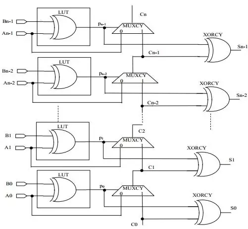

# Carry Save Adder (CSA)

A Carry Save Adder (CSA) is a digital adder that efficiently adds three or more binary numbers simultaneously without immediately propagating carries. It uses a set of full adders to sum corresponding bits of the input numbers and generates two outputs: a sum and a carry. Unlike traditional adders, CSA does not propagate the carry immediately; instead, it saves the carry to be processed later. This makes CSAs particularly useful in multi-operand addition, such as in multiplication algorithms where speed is crucial.

## Key Characteristics

- No Immediate Carry Propagation: This reduces the delay compared to traditional adders.
- Intermediate Sum and Carry: These outputs are later combined using additional logic or another adder.
- Efficiency: Ideal for high-speed arithmetic operations like in multiply-accumulate units (MACs).

### Carry Save Adder (CSA) vs. Ripple Carry Adder (RCA) and Carry Look-Ahead Adder (CLA)

A **Carry Save Adder (CSA)** is designed for adding multiple binary numbers quickly by generating two intermediate outputs: a sum and a carry, without immediately propagating the carry, unlike a **Ripple Carry Adder (RCA)**. 

In RCA, each bit addition must wait for the previous carry to propagate, leading to a longer delay. 

The **Carry Look-Ahead Adder (CLA)** improves on RCA by computing carries in parallel, reducing delay, but still relies on carry propagation. CSA avoids carry propagation during initial addition, making it faster for multi-operand additions, such as in multiplication, where speed is critical. However, the final sum in CSA requires an additional step to process the carries.

 