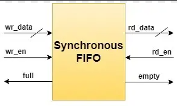

# FIFO 📥

**First In First Out**

A sequential type of memory used to pass data between two asynchronous clock domains. Usually between two systems working in same clock but with different throughput. 



### Uses of FIFO

- Avoid **Overflow**
  - Writing is faster than reading.
- Avoid **Underflow**
  - Writing is slower than reading.

## Depth Calculation

Size of FIFO basically implies that how much data is required to buffer.
Consider the worst case while reading and writing. So the depth basically depend on the rate of reading and writing and the size of data.

> [!NOTE]
> Things to consider before calculating depth
> - Read Frequency
> - Write Frequency
> - Data Length
> - Idle Cycles in operations

#### CASE 1
~~~
Write Frequency > Read Frequency
~~~

> <details>
>     <summary>How to Proceed</summary>
> 
> ```
> F write = 80MHz   F read = 50Mz   Burst Length = 120
> Consider no idle cycle between
> ```
>
> 
> Time required to write one data item   = $\frac{1}{F_w}$ = $\frac{1}{80M}$ = 12.5 ns
>
> Time required for writing whole data = 120 * 12.5 = 1500 ns
>
> Time required to read one data item   = $\frac{1}{F_r}$ = $\frac{1}{50M}$ = 20 ns
>
> Number of data read during 1500ns  =  $\frac{1500}{20}$ = 75
>
> Number of Data needed to store in FIFO = 120(Total data) - 75(read Data) = 45
>
> 
> </details>


#### CASE 1
~~~
Write Frequency > Read Frequency
~~~

<details>
    <summary>EXAMPLE</summary>
</details>


#### CASE 1
~~~
Write Frequency > Read Frequency
~~~

<details>
    <summary>EXAMPLE</summary>
</details>
